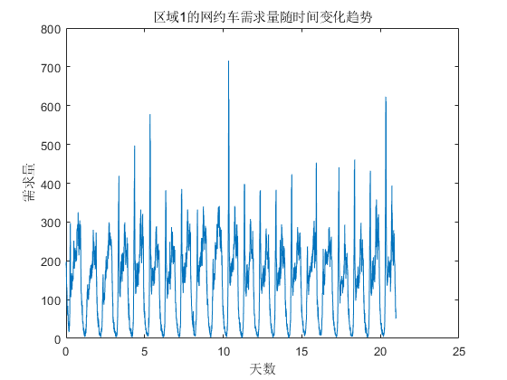
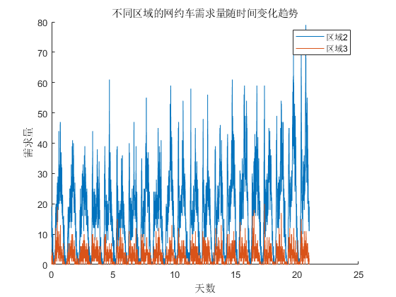
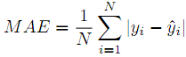
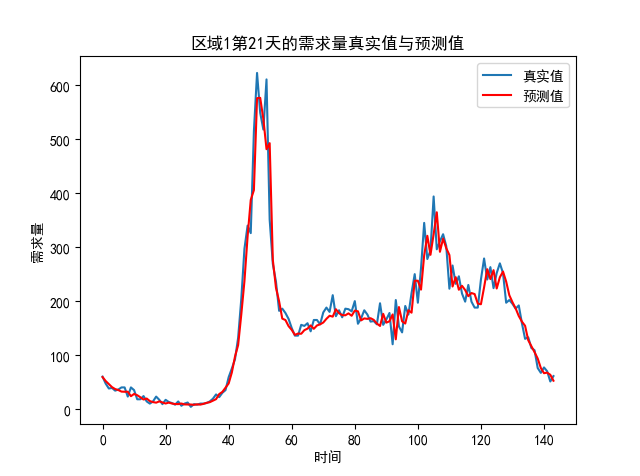
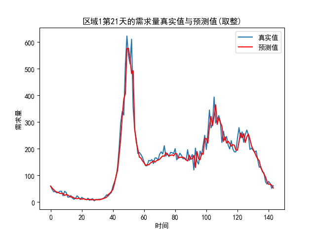
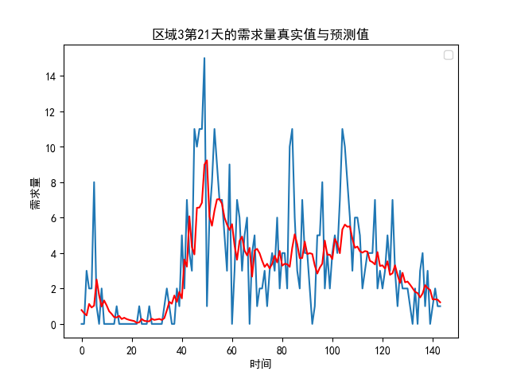
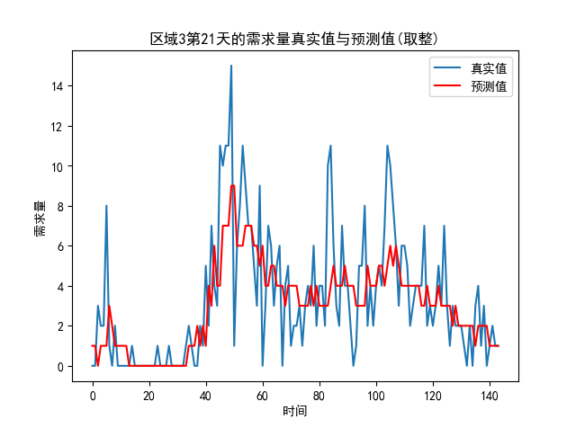
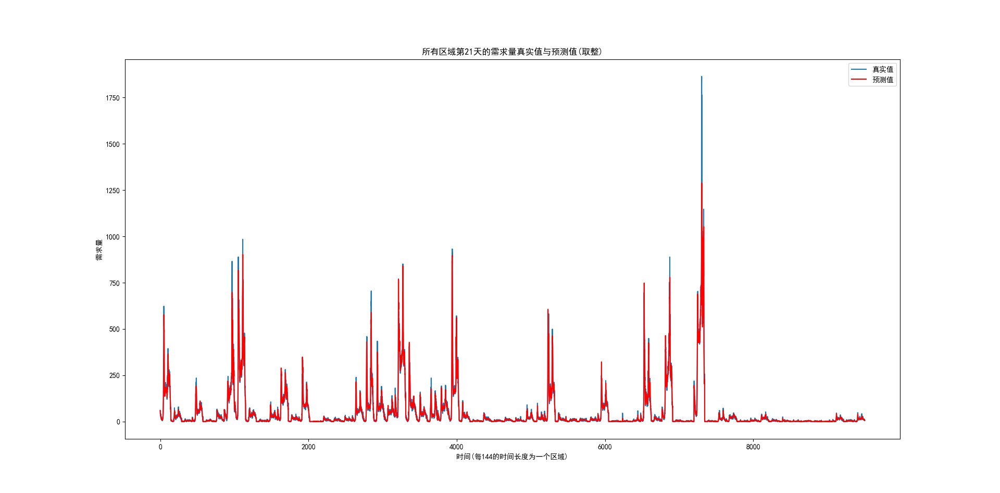

# DemandPredictionForCar
Prediction on demand of e-hailing trips（网约车出行需求预测）

## 要求

&emsp;demand10是网约车订单数据处理后得到的网约车需求数据。时间为从2×年×月1日至×年×月21日。网约车需求数据的时间间隔为10分钟，每天144个采样点，共计3024个点。网约车需求数据每一行代表一个时间点，而每一列代表一个区域。数据中各个区域已经划分完成，共计66个区域。使用一部分数据作为训练集，一部分数据作为测试集，建立预测模型，测试预测效果。

## 方法

### 特征向量构造方法

&emsp;以下图所示的区域1的网约车需求量与时间的关系曲线为例，可以看到其大概以一天为周期呈现周期波动的趋势，因此一种最naive的想法是可以以若干天的需求数据作为样本特征，预测其后若干天的需求量，这样其实体现了一种根据历史进行预测的思想。但因为数据集并不大，这么做会导致训练样本数量的减少，同时在实际测试中，并没有发现这种样本构造方法对预测效果的显著提升效果。因此选择采用一种根据趋势进行预测的方法，即选择当前时间片之前的若干个时间片（十分钟为一个时间片）的需求量数据作为用于预测的特征向量的一部分，当前时间片的需求量作为预测量。

&emsp;另外，通过对不同区域的需求量数据进行可视化分析如下图所示，可以看到不同区域对于需求量也有着很大的影响，因此把区域ID也作为用于预测的特征向量的一部分。

### 训练集、测试集的划分

&emsp;简单地将21天的数据中的前20天作为训练集，最后一天的数据作为测试集。同时在训练集中进行训练的时候选择10折交叉验证，即在训练过程中把训练集拆分成等大的10份，轮流把其中的9份用于模型的训练，另外的1份作为验证集用于模型验证。

### 模型选择

&emsp;因为我们的目的是对网约车的出行需求进行预测，本质上这就是一个回归问题。用来实现回归的方法主要有两大类：神经网络和回归树。考虑到数据集不是很大，如果使用神经网络的方法，容易发生过拟合或者预测效果不好的现象，同时对时间和内存的需求也较大。从而，实验中选择使用回归树的方法，回归树模型的预测本质是将输入空间划分为有限的输出单元，并在每个输出单元上计算预测值。更具体地，实验中采用的回归树模型是梯度渐进回归树，它是对传统Boosting算法的改进，通过将多个采用树模型的弱学习器提升为强学习器，具有较强的泛化能力。

### 评价指标

&emsp;考虑到出行车需求预测的实际意义，我们在意的是预测量与真实需求量之间的误差，因而选择平均绝对误差作为评价指标评价预测效果，其公式如下：

## 实验结果

&emsp;基于上述所述模型和特征向量构造方法，对回归树模型进行训练，得到了 MAE 值为 7.047 的实验结果。另外，如下四个图展示了两个不同区域的网约车出行需求量的预测结果。第一个图是对区域1的预测，第二个图是对预测值取整之后的结果（考虑到需求量应该是整数）；类似地，第三个图是对区域3的预测，第四个图是对预测值取整之后的结果。因为本身区域3的绝对需求量比区域1要少，从视觉效果上看似乎区域3的对需求量的预测结果波动性更大，但其实从评价指标MAE上来看的话区域3的预测结果（MAE 为 1.65）要好于区域1（MAE 为 18.03），这主要是因为区域1比区域3的绝对需求量要大许多的原因。从总体上来说，对于两个区域，预测曲线较好地拟合了真实的需求曲线，我们可以认为训练得到的回归树模型较好地预测了网约车出行需求量在一天之内的变化趋势。

&emsp;另外，我们将所有 66 个区域第 21 天的需求量真实值与预测值曲线绘于一张图上如下图所示，可以看到在各个区域，实验中给出的回归树模型均给出了较好的拟合。

